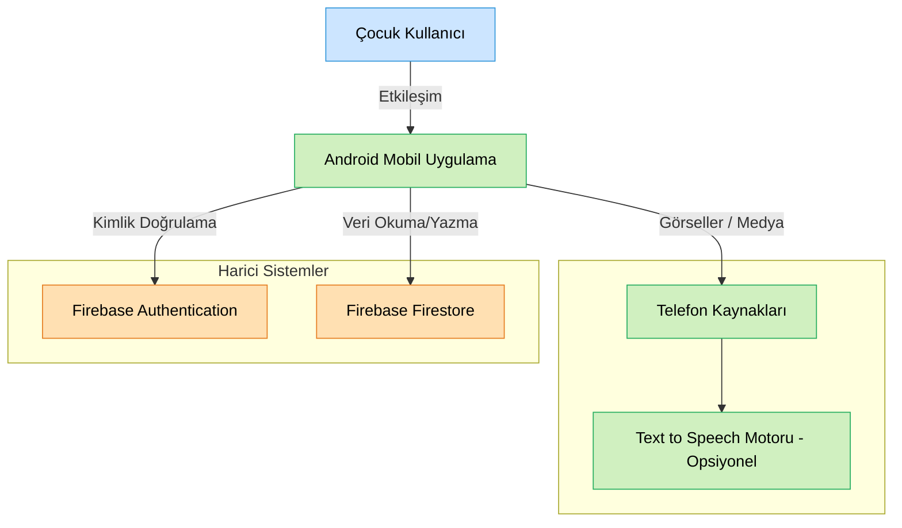
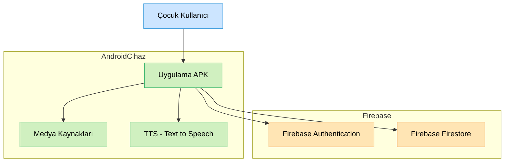

<!-- TOC start (generated with https://github.com/derlin/bitdowntoc) -->
# İçindekiler

## [1. Giriş ve Amaç (Mimari ve Uygulama Planı)](#1-giri-ve-amaç-mimari-ve-uygulama-plan)
- [1.1 Dosya Planı ve Modül Eşleştirmesi](#11-dosya-plan-ve-modül-eletirmesi)
- [1.2 Belgenin Kapsamı](#12-belgenin-kapsam)

## [2. Kısa Genel Bakış (Architectural Overview)](#2-ksa-genel-bak-architectural-overview)
- [2.1 Yapısal Katmanlar](#21-yapsal-katmanlar)
- [2.2 Mimari Genel Diyagram](#22-mimari-genel-diyagram)
- [2.3 Planlama Notları](#23-planlama-notlar)

## [3. Kapsam ve Bağlam (Context Boundary)](#3-kapsam-ve-balam-context-boundary)
- [3.1 Sistem Sınırları (System Scope)](#31-sistem-snrlar-system-scope)
- [3.2 Sistem Bağlam Diyagramı](#32-sistem-balam-diyagram)
- [3.3 Sistem Dışı Kapsam](#33-sistem-d-kapsam)
- [3.4 Kapsam Özet Haritası](#34-kapsam-özet-haritas)

## [4. Kullanım Senaryoları (Use Cases / User Stories)](#4-kullanm-senaryolar-use-cases-user-stories)
- [4.1 Kullanıcı Hikayeleri (User Stories)](#41-kullanc-hikayeleri-user-stories)
- [4.2 Kullanım Senaryoları (Use Cases)](#42-kullanm-senaryolar-use-cases)
  - [UC-01: Kullanıcı Kaydı](#uc-01-kullanc-kayd)
  - [UC-02: Kullanıcı Girişi](#uc-02-kullanc-girii)
  - [UC-03: Analog Saat Öğrenimi](#uc-03-analog-saat-örenimi)
  - [UC-04: Mevsimler Öğrenimi](#uc-04-mevsimler-örenimi)
  - [UC-05: Haftanın Günleri ve Aylar Öğrenimi](#uc-05-haftann-günleri-ve-aylar-örenimi)
  - [UC-06: İleri Yönde Sayı Hatırlama](#uc-06-ileri-yönde-say-hatrlama)
  - [UC-07: Geriye Doğru Sayı Hatırlama](#uc-07-geriye-doru-say-hatrlama)
  - [UC-08: Kelime Yazımı](#uc-08-kelime-yazm)
  - [UC-09: Yön Kavramları Öğrenimi](#uc-09-yön-kavramlar-örenimi)
  - [UC-10: Çarpım Tablosu Öğrenimi](#uc-10-çarpm-tablosu-örenimi)
  - [UC-11: Eşleştirme Oyunu](#uc-11-eletirme-oyunu)
  - [UC-12: Göz Takip Egzersizi](#uc-12-göz-takip-egzersizi)

## [5. Çözüm Stratejisi (Solution Strategy)](#5-çözüm-stratejisi-solution-strategy)
- [5.1 Platform ve Dil](#51-platform-ve-dil)
- [5.2 Mimari Yaklaşım](#52-mimari-yaklam)
- [5.3 Veri Yönetimi ve Senkronizasyon](#53-veri-yönetimi-ve-senkronizasyon)
- [5.4 Medya ve Etkileşim](#54-medya-ve-etkileim)
- [5.5 Genişletilebilirlik ve Sürdürülebilirlik](#55-geniletilebilirlik-ve-sürdürülebilirlik)
- [5.6 Test Stratejisi](#56-test-stratejisi)

## [6. Yapılandırma Bakış Açısı (Building Block View)](#6-yaplandrma-bak-açs-building-block-view)
- [6.1 Üst Seviye Bileşenler](#61-üst-seviye-bileenler)
- [6.2 Üst Seviye Yapı Diyagramı](#62-üst-seviye-yap-diyagram)
- [6.3 Bileşen Açıklamaları](#63-bileen-açklamalar)

## [7. Dağıtım Bakış Açısı (Deployment View)](#7-datm-bak-açs-deployment-view)
- [7.1 Dağıtım Ortamı](#71-datm-ortam)
- [7.3 Bağımlılıklar ve Gereksinimler](#73-bamllklar-ve-gereksinimler)
- [7.4 Notlar](#74-notlar)

## [8. Katmanlar Arası Konular (Cross-cutting Concepts)](#8-katmanlar-aras-konular-cross-cutting-concepts)
- [8.1 Çoklu Dil Desteği](#81-çoklu-dil-destei)
- [8.2 Tutarlı UI Tasarımı](#82-tutarl-ui-tasarm)
- [8.3 Sesli ve Görsel Geri Bildirim](#83-sesli-ve-görsel-geri-bildirim)
- [8.4 Kullanıcı Deneyimi (UX)](#84-kullanc-deneyimi-ux)
- [8.5 Ortak Kod Paylaşımı](#85-ortak-kod-paylam)
- [8.6 Çevrimdışı Erişim](#86-çevrimd-eriim)

## [9. Kaynaklar ve Referanslar](#9-kaynaklar-ve-referanslar)

<!-- TOC end -->

<!-- TOC -->
# 1. Giriş ve Amaç (Mimari ve Uygulama Planı)

Bu doküman, 2025 Bahar döneminde CMP2004 - Advanced Java Programming dersi kapsamında geliştirilecek olan bir Android mobil eğitim uygulamasının yazılım mimarisini ve geliştirme planını tanımlar. Hazırlanan bu belge, [arc42](https://arc42.org/) yazılım mimarisi şablonuna uygun olarak yapılandırılmıştır.

Doküman, yalnızca sistemin yapısal mimarisini değil; aynı zamanda hangi modülün, hangi dosyada/sınıfta geliştirileceğini ve nasıl organize edileceğini belirten bir **ön-geliştirme planı** olarak da görev yapar. **Bu dokümanda yer alan tüm içerikler değişime ve geliştirilmeye açıktır, hiçbir karar henüz tam olarak netleştirilmemiştir.**

Geliştirilecek olan bu proje, 7–10 yaş arası çocuk kullanıcılar için eğlenceli ve etkileşimli bir şekilde eğitsel içerik sunmayı amaçlamaktadır. Proje, çocukların hem öğrenmesini hem de pekiştirme yapmasını sağlayacak öğrenme ve oyun modlarına sahiptir.

Android platformunda Java diliyle geliştirilecek olan proje, Firebase Authentication ve Firestore ile kullanıcı ve skor verilerini yönetecek; Material Design ilkeleriyle kullanıcı dostu bir arayüz sunacaktır.

> **Not:** Bu belgede yer alan bazı mimari diyagramlar, [Mermaid](https://mermaid.js.org/) dili kullanılarak hazırlanmıştır.  
> GitHub üzerinde bu diyagramlar **doğrudan görsel olarak** render edilir.  
> Renkler ve stiller; bileşen türlerini (Firebase servisleri, cihaz bileşenleri, kullanıcılar vb.) ayırt etmek için kullanılmıştır:

| Renk         | Anlamı                            |
|--------------|-----------------------------------|
| 🟠 Turuncu    | Firebase servisleri (Auth, Firestore) |
| 🟢 Yeşil      | Android cihaz içi modüller         |
| 🔵 Mavi       | Kullanıcı (Çocuk kullanıcı)        |

<!-- TOC -->
## 1.1 Dosya Planı ve Modül Eşleştirmesi

Aşağıda, planlanan temel işlevlerin proje dizininde karşılık geleceği dosya/sınıflar listelenmiştir. Bu yapı, mevcut TinyTalks projesinden mimari olarak esinlenmiş; ancak içerik ve organizasyon olarak özgünleştirilecektir.

| Özellik                          | Dosya/Sınıf Adı                             | Açıklama |
|----------------------------------|---------------------------------------------|----------|
| Ana ekran ve modül yönlendirme  | `MainActivity.java`                         | Tüm oyun ve öğrenme modüllerine giriş noktası |
| Kullanıcı girişi/kaydı          | `LoginActivity.java`, `RegisterActivity.java` | Firebase Auth ile oturum işlemleri |
| Analog saat öğrenimi            | `ClockActivity.java`                        | Etkileşimli saat ibreleri ve dijital gösterim |
| Mevsimler                       | `SeasonsActivity.java`, `SeasonsPlayingActivity.java` | Görsel anlatım ve oyun modülü |
| Günler ve aylar                 | `DaysActivity.java`, `MonthsActivity.java`, `PlayDaysActivity.java`, `PlayMonthsActivity.java` | Sıralama ve oyun ekranları |
| Sayı hatırlama (ileri/geri)     | `DigitForwardActivity.java`, `DigitBackwardActivity.java` | Hafıza geliştirme oyunları |
| Yön kavramları                  | `DirectionsActivity.java`, `DirectionsGameActivity.java` | Sol, sağ, ön, arka yönlerini gösteren egzersizler |
| Kelime yazımı                   | `SpellActivity.java`                        | Görsel ve sesli destekli yazım oyunu |
| Çarpım tablosu                  | `MultiplicationActivity.java`               | Soru-cevap temelli matematik oyunu |
| Eşleştirme oyunu                | `SimilarPictureActivity.java`               | Kart/tabanlı görsel hafıza oyunu |
| Göz takip egzersizi             | `BallScreenActivity.java`, `GameSurface.java`, `SeamlessBackgroundView.java` | Ekranda hareket eden nesneye odaklanma |
| Ortak yapılar ve karakter       | `TalkingCharacter.java`, `LearningPartActivity.java`, `PlayingPartActivity.java` | Maskot, oyun/öğrenme yapılarını yöneten bileşenler |

<!-- TOC -->
## 1.2 Belgenin Kapsamı

Bu belge aşağıdaki hedeflere ulaşmak üzere yapılandırılmıştır:
- Uygulamanın temel mimari yapısının belirlenmesi
- Eğitim modüllerinin sistemde nasıl yer alacağının planlanması
- Geliştirme sürecine öncülük edecek sınıf ve dosya yapılarının belirlenmesi
- UI katmanından veri erişimine kadar tüm bileşenlerin planlı bir şekilde tasarlanması

Bu yönüyle belge, geliştiriciler için hem bir **tasarım referansı**, hem de bir **proje geliştirme kılavuzu** niteliği taşır.

---

<!-- TOC -->
# 2. Kısa Genel Bakış (Architectural Overview)

Bu proje, çocuklara yönelik eğitsel içerikler sunan Android tabanlı bir mobil uygulama olarak geliştirilecektir. Kullanıcılara, öğrenme ve oyun modları aracılığıyla çeşitli konularda (saat okuma, mevsimler, yönler, hafıza oyunları, çarpım tablosu vb.) etkileşimli içerikler sunmayı hedefler.

Uygulamanın mimarisi, **modüler ve fonksiyon bazlı bir yapı** benimseyerek sade, sürdürülebilir ve genişletilebilir olacak şekilde tasarlanmıştır. Proje, Android’in klasik `Activity` tabanlı yapısını kullanmakta olup, her eğitsel modül için ayrı bir `Activity` sınıfı tanımlanmıştır. Veri işleme ve kullanıcı etkileşimleri doğrudan bu `Activity` sınıfları üzerinden yönetilir.

<!-- TOC -->
### 2.1 Yapısal Katmanlar

- **Activity Katmanı:**  
  Kullanıcının uygulama ile doğrudan etkileşime girdiği ekranlardır. Her oyun veya öğrenme modülünün kendine ait bir `Activity`’si bulunmaktadır.
  
- **Yardımcı Sınıflar (Helper/Manager):**  
  Ortak işlevlerin yürütüldüğü, örneğin sesli geri bildirim, karakter animasyonu, skor hesaplama gibi mekanizmaların tanımlandığı sınıflardır.
  
- **Firebase Katmanı:**  
  Firebase Authentication ile kullanıcı kimlik doğrulama, Firestore ile veri saklama işlemleri gerçekleştirilir.

<!-- TOC -->
### 2.2 Mimari Genel Diyagram

Aşağıda uygulamanın bileşenlerini ve aralarındaki temel ilişkiyi gösteren üst düzey bir mimari diyagram yer almaktadır:

<!-- TOC -->
### 2.3 Planlama Notları

- Her `Activity`, kendi görsel ve mantıksal bileşenleriyle tek bir sınıf içerisinde geliştirilmektedir.
- Modüller, hem "öğrenme" hem de "oyun" odaklı ekranları içerir, ancak bu ekranlar genellikle ayrı `Activity` dosyaları olarak yapılandırılmıştır.
- Ortak bileşenler (örneğin konuşan karakter, sesli yanıtlar, skor hesaplama) `TalkingCharacter.java`, `LearningPartActivity.java`, `PlayingPartActivity.java` gibi merkezi dosyalarda tutulur.
- Veri yönetimi, doğrudan Firebase SDK üzerinden yapılmakta; herhangi bir `Repository` ya da `ViewModel` katmanı kullanılmamaktadır.

---

<!-- TOC -->
# 3. Kapsam ve Bağlam (Context Boundary)

Bu mobil uygulama, Android işletim sistemi üzerinde çalışan, çevrimdışı/çevrimiçi kullanılabilen bir eğitim uygulamasıdır. Kullanıcı etkileşimleri doğrudan cihaz üzerinde gerçekleşirken; kullanıcı kimlik yönetimi ve veri saklama işlemleri, internet bağlantısı mevcutsa Firebase altyapısı ile senkronize edilir.

Sistem, temel olarak aşağıdaki bileşenleri içerir:

<!-- TOC -->
### 3.1 Sistem Sınırları (System Scope)

| Bileşen                      | Açıklama |
|-----------------------------|----------|
| Android Mobil Uygulama      | Projenin ana çalıştığı ortam. Kullanıcılar doğrudan bu uygulama ile etkileşime geçer. |
| Firebase Authentication     | Kullanıcı kayıt ve giriş işlemleri bu servis aracılığıyla gerçekleştirilir. |
| Firebase Firestore          | Skorlar, oyun verileri ve kullanıcıya özgü ilerleme bilgileri burada saklanır. |
| Cihaz Üzerindeki Kaynaklar  | Animasyonlar, görseller vb. tüm medya içerikleri cihazın local belleğinde tutulur. |
| Text-to-Speech (Opsiyonel)  | Android'in yerel TTS servisi ileride sesli anlatımlar için entegre edilebilir. |

<!-- TOC -->
### 3.2 Sistem Bağlam Diyagramı

<!-- TOC -->
### 3.3 Sistem Dışı Kapsam

Aşağıdaki unsurlar bu sistemin doğrudan parçası değildir, ancak sistemle dolaylı olarak ilişkilidir:

- **Ebeveyn Paneli / Ebeveyn Hesabı**: Projenin güncel gereksinimlerine göre kapsam dışıdır. Gelecekte uygulanabilir.
- **Sosyal Medya Paylaşımı**: Kullanıcı skorlarını dışa aktarma özelliği bulunmamaktadır.
- **Çok Oyunculu Oyunlar**: Proje sadece bireysel kullanıcı etkileşimi ile sınırlıdır.

<!-- TOC -->
### 3.4 Kapsam Özet Haritası

| İç Sistem Unsuru              | Dış Sistem / Kaynak              | İlişki Türü            |
|-------------------------------|----------------------------------|------------------------|
| Mobil Uygulama               | Firebase Authentication          | Giriş/Kayıt işlemleri  |
| Mobil Uygulama               | Firebase Firestore               | Veri saklama           |
| Mobil Uygulama               | Cihaz Belleği / Medya Kaynakları | Görsel içerik kullanımı|
| Mobil Uygulama               | Android TTS (Opsiyonel)          | Sesli anlatım (opsiyonel) |

---

<!-- TOC -->
# 4. Kullanım Senaryoları (Use Cases / User Stories)

Bu bölümde, projenin hedeflediği işlevlerin kullanıcı odaklı bakış açısıyla nasıl şekillendiği anlatılmaktadır. Hem kullanıcı hikayeleri hem de detaylı kullanım senaryoları ayrı alt başlıklar altında verilmiştir.

<!-- TOC -->
## 4.1 Kullanıcı Hikayeleri (User Stories)

Aşağıdaki kullanıcı hikayeleri, projenin temel kullanıcı grubu olan çocukların ve geliştiricinin sistemden beklentilerini tanımlar. Her hikaye, kabul kriterleri ile birlikte verilmiştir.

| Kim?               | Ne istiyor?                                                       | Kabul Kriterleri |
|--------------------|--------------------------------------------------------------------|------------------|
| Geliştirici        | Firebase ile kullanıcı verilerini saklamak                        | Firebase Authentication ve Firestore başarıyla entegre edilmeli |
| Çocuk kullanıcı    | Hesap oluşturup sisteme giriş yapmak                              | Kullanıcı adı ve yaş bilgisiyle kayıt yapılabilmeli, bilgiler Firebase’e kaydedilmeli |
| Çocuk kullanıcı    | Analog saati öğrenmek                                              | Etkileşimli saat ibreleri sürüklenebilir olmalı, dijital karşılık gösterilmeli |
| Çocuk kullanıcı    | Mevsimleri animasyonlarla öğrenmek                                | Her mevsim için sesli anlatım ve animasyon sunulmalı |
| Çocuk kullanıcı    | Günleri sırayla öğrenmek                                           | Günler sesli okunmalı, doğru sıralama ile oyun tamamlanmalı |
| Çocuk kullanıcı    | Ayları sırayla öğrenmek                                            | Aylar sıralı sunulmalı, sürükle-bırak yöntemiyle sıralama yapılabilmeli |
| Çocuk kullanıcı    | Rakamları sırayla ezberlemek                                       | Gösterilen sayılar 1 saniyelik aralıklarla gösterilmeli, kullanıcıdan tekrar girişi istenmeli |
| Çocuk kullanıcı    | Rakamları tersten ezberlemek                                       | Kullanıcıdan sayıları tersten girmesi beklenmeli, yanlışta tekrar hakkı olmalı |
| Çocuk kullanıcı    | Kelimeleri doğru yazmak                                            | Kelime sesli veya görsel olarak gösterilmeli, yazım ekranı çocuk dostu olmalı |
| Çocuk kullanıcı    | Yön kavramlarını öğrenmek                                          | Sol, sağ, ön, arka yönleri sesli ve görsel şekilde anlatılmalı |
| Çocuk kullanıcı    | Çarpım sorularını çözmek                                           | Kolaydan zora rastgele sorular gelmeli, puanlama ve olumlu geri bildirim verilmeli |
| Çocuk kullanıcı    | Eşleşen görselleri bulmak                                          | Kartlar kapalı başlamalı, eşleşmelerde sesli/görsel geri bildirim sağlanmalı |
| Çocuk kullanıcı    | Ekrandaki hareketli topu gözle takip etmek                         | Top farklı yönlerde hareket etmeli, egzersiz süresi 30–60 saniye arası olmalı |
| Çocuk kullanıcı    | Öğrenme ve oyun modları arasında geçiş yapmak                      | Her modülde ayrı öğrenme ve oyun ekranı olmalı |
| Çocuk kullanıcı    | Puan kazanırken olumlu geri bildirim almak                        | Başarı durumlarında animasyon veya sesli mesajlar gösterilmeli |
| Disleksiye sahip çocuk | Disleksi dostu tasarım görmek                                  | Büyük font, düşük kontrast renkler ve sade ikonlar kullanılmalı |
| İki dilli çocuk    | Türkçe ve İngilizce arasında geçiş yapmak                          | Dil değişimi ayarlar menüsünden yapılabilmeli |
| Çocuk kullanıcı    | Maksimum 3 tıklama ile tüm aktivitelere erişmek                    | Ana ekrandan en fazla 2 alt menüyle hedef aktiviteye ulaşılabilmeli |

<!-- TOC -->
## 4.2 Kullanım Senaryoları (Use Cases)

Her bir kullanım senaryosu sistemin nasıl tepki verdiğini, kullanıcılarla nasıl etkileşim kurduğunu ve hangi iş akışlarının uygulandığını gösterir.

Bu bölüm, kullanıcı ihtiyaçlarını doğrudan adreslediği için geliştirme sırasında modül önceliklendirme, test senaryosu üretme ve UX iyileştirme konularında da rehberlik edecektir.

<!-- TOC -->
### UC-01: Kullanıcı Kaydı
**İlgili Sınıf(lar):** `RegisterActivity.java`

| Alan | İçerik |
|------|--------|
| **Use Case ID** | UC-01 |
| **Use Case Adı** | Kullanıcı Kaydı |
| **Aktörler** | Çocuk Kullanıcı |
| **Açıklama** | Yeni kullanıcının sisteme kayıt olması |
| **Tetikleyici** | Kullanıcının uygulamayı ilk kez açması |
| **Ön Koşullar** | 1. Uygulama yüklenmiş olmalı 2. İnternet bağlantısı olmalı |
| **Normal Akış** | 1. Kullanıcı uygulamayı açar 2. "Kayıt Ol" butonuna tıklar 3. Kullanıcı adı, yaş ve diğer temel bilgileri girer 4. "Kayıt Ol" butonuna tıklar 5. Sistem bilgileri doğrular 6. Sistem Firebase'e kullanıcı kaydını gerçekleştirir 7. Sistem ana ekrana yönlendirir |
| **Alternatif Akışlar** | **A1: Geçersiz Bilgi** 4a. Sistem girilen bilgilerde geçersizlik tespit eder 4b. Sistem kullanıcıya hata mesajı gösterir 4c. Kullanıcı tekrar bilgileri girer ve 4. adımdan devam eder  **A2: Bağlantı Hatası** 6a. Sistem bağlantı hatası tespit eder 6b. Sistem kullanıcıya bağlantı hatası mesajı gösterir 6c. Kullanıcı "Tekrar Dene" butonuna tıklar ve 6. adımdan devam eder |
| **Son Koşullar** | Kullanıcı sisteme başarıyla kaydedilir ve oturumu açılır |
| **Sıklık** | Kullanıcı başına bir kez |

---

<!-- TOC -->
### UC-02: Kullanıcı Girişi
**İlgili Sınıf(lar):** `LoginActivity.java`

| Alan | İçerik |
|------|--------|
| **Use Case ID** | UC-02 |
| **Use Case Adı** | Kullanıcı Girişi |
| **Aktörler** | Çocuk Kullanıcı |
| **Açıklama** | Kayıtlı kullanıcının sisteme giriş yapması |
| **Tetikleyici** | Kullanıcının uygulamayı açması |
| **Ön Koşullar** | 1. Kullanıcının önceden kayıt olmuş olması 2. İnternet bağlantısı olmalı |
| **Normal Akış** | 1. Kullanıcı uygulamayı açar 2. Kullanıcı adı/profil resmi seçer 3. (Gerekliyse) şifre girer 4. "Giriş Yap" butonuna tıklar 5. Sistem kullanıcı bilgilerini doğrular 6. Sistem ana ekrana yönlendirir |
| **Alternatif Akışlar** | **A1: Hatalı Bilgi** 5a. Sistem hatalı bilgi tespit eder 5b. Sistem kullanıcıya hata mesajı gösterir 5c. Kullanıcı bilgileri tekrar girer ve 4. adımdan devam eder  **A2: Şifremi Unuttum** 3a. Kullanıcı "Şifremi Unuttum" butonuna tıklar 3b. Sistem şifre sıfırlama sürecini başlatır |
| **Son Koşullar** | Kullanıcı sisteme başarıyla giriş yapar ve ana ekranı görür |
| **Sıklık** | Her uygulama açılışında (oturum açık değilse) |

<!-- TOC -->
### UC-03: Analog Saat Öğrenimi  
**İlgili Sınıf(lar):** `ClockActivity.java`

| Alan | İçerik |
|------|--------|
| **Use Case ID** | UC-03 |
| **Use Case Adı** | Analog Saat Öğrenimi |
| **Aktörler** | Çocuk Kullanıcı |
| **Açıklama** | Kullanıcının analog saat okumayı öğrenmesi |
| **Tetikleyici** | Kullanıcının "Saat Öğrenme" aktivitesini seçmesi |
| **Ön Koşullar** | 1. Kullanıcı giriş yapmış olmalı |
| **Normal Akış** | 1. Kullanıcı "Saat Öğrenme" aktivitesini seçer 2. Sistem animasyonlu saat modülünü gösterir 3. Sistem saat okuma kavramlarını adım adım anlatır 4. Kullanıcı saatin ibreleriyle etkileşime girer 5. Sistem dijital ve sözel karşılıkları gösterir 6. Kullanıcı "Oyun Modu"na geçer 7. Sistem rastgele saat gösterir ve kullanıcıdan doğru zamanı seçmesini ister 8. Sistem geri bildirim sağlar |
| **Alternatif Akışlar** | **A1: Öğrenme Tekrarı** 7a. Kullanıcı "Tekrar Öğren" butonuna tıklar 7b. Sistem 3. adıma döner |
| **Son Koşullar** | Kullanıcı analog saat okuma kavramlarını öğrenir ve alıştırma yapar |
| **Sıklık** | Kullanıcı isteğine bağlı, muhtemelen birkaç kez |

---

<!-- TOC -->
### UC-04: Mevsimler Öğrenimi  
**İlgili Sınıf(lar):** `SeasonsActivity.java`, `SeasonsPlayingActivity.java`

| Alan | İçerik |
|------|--------|
| **Use Case ID** | UC-04 |
| **Use Case Adı** | Mevsimler Öğrenimi |
| **Aktörler** | Çocuk Kullanıcı |
| **Açıklama** | Kullanıcının mevsimleri multimedya animasyonlarıyla öğrenmesi |
| **Tetikleyici** | Kullanıcının "Mevsimler" aktivitesini seçmesi |
| **Ön Koşullar** | 1. Kullanıcı giriş yapmış olmalı |
| **Normal Akış** | 1. Kullanıcı "Mevsimler" aktivitesini seçer 2. Sistem dört mevsimden oluşan animasyonları gösterir 3. Her mevsim için sesli anlatım ve görseller sunulur 4. Kullanıcı mevsimler arasında geçiş yapar 5. Kullanıcı "Oyun Modu"na geçer 6. Sistem mevsimlerle ilgili sorular sorar 7. Sistem geri bildirim sağlar ve puanları kaydeder |
| **Alternatif Akışlar** | **A1: Belirli Mevsimi İnceleme** 3a. Kullanıcı bir mevsimi seçer 3b. Sistem o mevsimin detaylı animasyonunu gösterir |
| **Son Koşullar** | Kullanıcı mevsimleri öğrenir ve aktiviteyi tamamlar |
| **Sıklık** | Kullanıcı isteğine bağlı, birkaç kez |

---

<!-- TOC -->
### UC-05: Haftanın Günleri ve Aylar Öğrenimi  
**İlgili Sınıf(lar):** `DaysActivity.java`, `MonthsActivity.java`, `PlayDaysActivity.java`, `PlayMonthsActivity.java`

| Alan | İçerik |
|------|--------|
| **Use Case ID** | UC-05 |
| **Use Case Adı** | Haftanın Günleri ve Aylar Öğrenimi |
| **Aktörler** | Çocuk Kullanıcı |
| **Açıklama** | Haftanın günleri ve yılın aylarının öğrenilmesi |
| **Tetikleyici** | Kullanıcının "Takvim" aktivitesini seçmesi |
| **Ön Koşullar** | 1. Kullanıcı giriş yapmış olmalı |
| **Normal Akış** | 1. Kullanıcı "Takvim" aktivitesini seçer 2. Sistem alt seçimleri gösterir: "Günler" / "Aylar" 3. Kullanıcı birini seçer 4. Sistem günleri/ayları sırayla gösterir ve sesli okur 5. Kullanıcı "Oyun Modu"na geçer 6. Sistem gün/ayları karışık gösterir ve sıralama ister 7. Kullanıcı sürükle-bırak ile sıralar 8. Sistem geri bildirim verir |
| **Alternatif Akışlar** | **A1: Sıralama Zorluğu** 7a. Kullanıcı "İpucu"ya tıklar 7b. Sistem sıradaki öğeyi gösterir |
| **Son Koşullar** | Kullanıcı doğru sıralama yapar ve öğrenme tamamlanır |
| **Sıklık** | Kullanıcı isteğine bağlı, tekrar tekrar |

---

<!-- TOC -->
### UC-06: İleri Yönde Sayı Hatırlama  
**İlgili Sınıf(lar):** `DigitForwardActivity.java`

| Alan | İçerik |
|------|--------|
| **Use Case ID** | UC-06 |
| **Use Case Adı** | İleri Yönde Sayı Hatırlama |
| **Aktörler** | Çocuk Kullanıcı |
| **Açıklama** | Kullanıcının gösterilen rakamları sırayla hatırlaması |
| **Tetikleyici** | Kullanıcının "İleri Hatırlama" aktivitesini seçmesi |
| **Ön Koşullar** | 1. Kullanıcı giriş yapmış olmalı |
| **Normal Akış** | 1. Kullanıcı "Hafıza Oyunları" > "İleri Hatırlama"yı seçer 2. Sistem başlangıç seviyesi gösterir (3 rakam) 3. Rakamlar 1 saniye arayla gösterilir 4. Sistem kullanıcıdan giriş ister 5. Kullanıcı rakamları girer 6. Sistem doğruluğu kontrol eder 7. Başarılıysa zorluk artar |
| **Alternatif Akışlar** | **A1: Yanlış Cevap** 7a. Sistem tekrar hakkı verir 7b. Üç yanlışta seviye düşer |
| **Son Koşullar** | Kullanıcı oyunu tamamlar, puan kazanır |
| **Sıklık** | Sık sık |

---

<!-- TOC -->
### UC-07: Geriye Doğru Sayı Hatırlama  
**İlgili Sınıf(lar):** `DigitBackwardActivity.java`

| Alan | İçerik |
|------|--------|
| **Use Case ID** | UC-07 |
| **Use Case Adı** | Geriye Doğru Sayı Hatırlama |
| **Aktörler** | Çocuk Kullanıcı |
| **Açıklama** | Kullanıcının gösterilen rakamları tersten hatırlaması |
| **Tetikleyici** | Kullanıcının "Geriye Hatırlama" aktivitesini seçmesi |
| **Ön Koşullar** | 1. Kullanıcı giriş yapmış olmalı |
| **Normal Akış** | 1. Kullanıcı "Hafıza Oyunları" > "Geriye Hatırlama"yı seçer 2. Sistem başlangıç seviyesi gösterir (2 rakam) 3. Rakamlar gösterilir 4. Kullanıcı tersten giriş yapar 5. Sistem doğruluğu kontrol eder 6. Başarılıysa seviye artar |
| **Alternatif Akışlar** | **A1: Yanlış Cevap** 6a. Tekrar hakkı verilir 6b. Üç hata sonrası seviye düşer |
| **Son Koşullar** | Kullanıcı başarılı giriş yapar, skor alır |
| **Sıklık** | Sık sık |

<!-- TOC -->
### UC-08: Kelime Yazımı  
**İlgili Sınıf(lar):** `SpellActivity.java`

| Alan | İçerik |
|------|--------|
| **Use Case ID** | UC-08 |
| **Use Case Adı** | Kelime Yazımı |
| **Aktörler** | Çocuk Kullanıcı |
| **Açıklama** | Kullanıcının kelimelerin doğru yazılışını öğrenmesi |
| **Tetikleyici** | Kullanıcının "Kelime Oyunları" aktivitesini seçmesi |
| **Ön Koşullar** | 1. Kullanıcı giriş yapmış olmalı |
| **Normal Akış** | 1. Kullanıcı "Kelime Oyunları" aktivitesini seçer 2. Sistem bir görsel ve/veya sesli kelime gösterir 3. Sistem kullanıcıdan kelimeyi yazmasını ister 4. Kullanıcı ekran klavyesi ile kelimeyi yazar 5. Sistem yazımı kontrol eder ve geri bildirim verir 6. Doğruysa puan verilir ve yeni kelimeye geçilir |
| **Alternatif Akışlar** | **A1: Yanlış Yazım** 5a. Sistem hatayı tespit eder 5b. Kullanıcıya yeniden deneme hakkı verir (3 hak) 5c. 2. yanlışta ipucu gösterilir 5d. 3. yanlışta doğru yazım gösterilir ve sonraki kelimeye geçilir |
| **Son Koşullar** | Kullanıcı yazım aktivitesini tamamlar |
| **Sıklık** | Kullanıcı isteğine bağlı, sık sık |

---

<!-- TOC -->
### UC-09: Yön Kavramları Öğrenimi  
**İlgili Sınıf(lar):** `DirectionsActivity.java`, `DirectionsGameActivity.java`

| Alan | İçerik |
|------|--------|
| **Use Case ID** | UC-09 |
| **Use Case Adı** | Yön Kavramları Öğrenimi |
| **Aktörler** | Çocuk Kullanıcı |
| **Açıklama** | Kullanıcının temel yön kavramlarını öğrenmesi |
| **Tetikleyici** | Kullanıcının "Yönler" aktivitesini seçmesi |
| **Ön Koşullar** | 1. Kullanıcı giriş yapmış olmalı |
| **Normal Akış** | 1. Kullanıcı "Yönler" aktivitesini seçer 2. Sistem yön kavramlarını animasyonlu karakterlerle açıklar 3. Her yön için sesli ve görsel anlatım yapılır 4. Kullanıcı "Oyun Modu"na geçer 5. Sistem kullanıcıdan nesneleri doğru yöne yerleştirmesini ister 6. Kullanıcı sürükle-bırak ile yönlendirir 7. Sistem cevapları kontrol eder ve geri bildirim sağlar |
| **Alternatif Akışlar** | **A1: Yanlış Yerleştirme** 7a. Sistem kullanıcıya hatayı gösterir 7b. Kullanıcıya tekrar deneme hakkı verilir |
| **Son Koşullar** | Kullanıcı yön kavramlarını öğrenir |
| **Sıklık** | Kullanıcı isteğine bağlı, birkaç kez |

---

<!-- TOC -->
### UC-10: Çarpım Tablosu Öğrenimi  
**İlgili Sınıf(lar):** `MultiplicationActivity.java`

| Alan | İçerik |
|------|--------|
| **Use Case ID** | UC-10 |
| **Use Case Adı** | Çarpım Tablosu Öğrenimi |
| **Aktörler** | Çocuk Kullanıcı |
| **Açıklama** | Kullanıcının çarpım tablosunu öğrenmesi |
| **Tetikleyici** | Kullanıcının "Matematik > Çarpım Tablosu" aktivitesini seçmesi |
| **Ön Koşullar** | 1. Kullanıcı giriş yapmış olmalı |
| **Normal Akış** | 1. Kullanıcı "Matematik" aktivitesine girer 2. "Çarpım Tablosu" alt modülünü seçer 3. Sistem görsel destekli anlatım sunar 4. Kullanıcı "Oyun Modu"na geçer 5. Sistem rastgele çarpım soruları sorar 6. Kullanıcı ekrandan yanıt girer 7. Sistem doğruluğu kontrol eder ve geri bildirim verir 8. Doğru cevaplarda kullanıcı puan kazanır |
| **Alternatif Akışlar** | **A1: Yanlış Cevap** 7a. Sistem hatayı gösterir 7b. Üç yanlışta doğru cevabı gösterir ve devam eder |
| **Son Koşullar** | Kullanıcı aktiviteyi tamamlar |
| **Sıklık** | Kullanıcı isteğine bağlı, sık sık |

---

<!-- TOC -->
### UC-11: Eşleştirme Oyunu  
**İlgili Sınıf(lar):** `SimilarPictureActivity.java`

| Alan | İçerik |
|------|--------|
| **Use Case ID** | UC-11 |
| **Use Case Adı** | Eşleştirme Oyunu |
| **Aktörler** | Çocuk Kullanıcı |
| **Açıklama** | Kullanıcının benzer resimleri eşleştirmesi |
| **Tetikleyici** | Kullanıcının "Eşleştirme Oyunu" aktivitesini seçmesi |
| **Ön Koşullar** | 1. Kullanıcı giriş yapmış olmalı |
| **Normal Akış** | 1. Kullanıcı "Eşleştirme Oyunu"nu seçer 2. Sistem zorluk seviyesi sorar 3. Kullanıcı seviye seçer (kolay/orta/zor) 4. Sistem kapalı kart ızgarası gösterir 5. Kullanıcı iki kart açar 6. Kartlar eşleşirse açık kalır, eşleşmezse kapanır 7. Tüm kartlar eşleşene kadar devam eder 8. Oyun sonunda süre ve hamleye göre puan verilir |
| **Alternatif Akışlar** | **A1: Oyunu Sıfırlama** 8a. Kullanıcı "Yeniden Başlat" butonuna tıklar 8b. Sistem oyunu sıfırlar |
| **Son Koşullar** | Tüm kartlar eşleşir, skor verilir |
| **Sıklık** | Kullanıcı isteğine bağlı, sık sık |

---

<!-- TOC -->
### UC-12: Göz Takip Egzersizi  
**İlgili Sınıf(lar):** `BallScreenActivity.java`, `GameSurface.java`, `SeamlessBackgroundView.java`

| Alan | İçerik |
|------|--------|
| **Use Case ID** | UC-12 |
| **Use Case Adı** | Göz Takip Egzersizi |
| **Aktörler** | Çocuk Kullanıcı |
| **Açıklama** | Kullanıcının hareketli topu gözleriyle takip etmesi |
| **Tetikleyici** | Kullanıcının "Göz Takibi" aktivitesini seçmesi |
| **Ön Koşullar** | 1. Kullanıcı giriş yapmış olmalı |
| **Normal Akış** | 1. Kullanıcı "Göz Takibi" aktivitesini seçer 2. Sistem göz takibinin amacını açıklar 3. Kullanıcı "Başla" butonuna tıklar 4. Ekranda top çeşitli yönlerde hareket eder 5. Kullanıcı gözle takip eder 6. Egzersiz sonunda sistem puan ve geri bildirim verir |
| **Alternatif Akışlar** | **A1: Zorluk Değiştirme** 3a. Kullanıcı zorluk seçer 3b. Sistem topun hızı/pattern'ini ayarlar |
| **Son Koşullar** | Egzersiz tamamlanır, puan verilir |
| **Sıklık** | Kullanıcı isteğine bağlı, sık sık |

<!-- TOC -->
# 5. Çözüm Stratejisi (Solution Strategy)

Bu bölümde, sistemin temel tasarım kararları, kullanılacak teknolojiler ve çözüm stratejileri özetlenmektedir. Seçilen yaklaşımlar, projenin hedef kitlesine (7–10 yaş arası çocuk kullanıcılar) uygun kullanıcı deneyimini garanti altına almak amacıyla belirlenmiştir.

<!-- TOC -->
## 5.1 Platform ve Dil

- **Android** mobil işletim sistemi hedef alınmıştır.
- Uygulama, **Java** dili kullanılarak geliştirilecektir.
- Android’in SDK araçları, **Android Studio** IDE’si ile birlikte kullanılacaktır.

<!-- TOC -->
## 5.2 Mimari Yaklaşım

- Uygulama klasik **Activity tabanlı bir mimariye** sahiptir.
- Her öğrenme modülü, bağımsız bir `Activity` sınıfı olarak tanımlanır ve kendi içindeki işlevleri doğrudan yönetir.
- UI bileşenleri, **Material Design** prensiplerine uygun, çocuk dostu şekilde tasarlanacaktır.

<!-- TOC -->
## 5.3 Veri Yönetimi ve Senkronizasyon

- Kullanıcı kayıt ve oturum işlemleri **Firebase Authentication** ile yapılacaktır.
- Skorlar, oyun ilerlemeleri ve kullanıcı profili gibi veriler **Firebase Firestore** üzerinde saklanacaktır.
- Veri erişimi ve eş zamanlılık Firebase SDK ile doğrudan sağlanacaktır.

<!-- TOC -->
## 5.4 Medya ve Etkileşim

- **Animasyonlar, ikonlar, ses dosyaları ve karakterler**, cihazın lokal belleğinde saklanacaktır.
- Tüm kullanıcı arayüzleri çocuk dostu ve basit tasarımlı olacak şekilde planlanacaktır.
- Sesli anlatım için Android’in yerleşik **Text-to-Speech (TTS)** motoru opsiyonel olarak entegre edilebilir.

<!-- TOC -->
## 5.5 Genişletilebilirlik ve Sürdürülebilirlik

- Tüm öğrenme modülleri aynı şablon üzerinde geliştirilecektir: `LearningActivity` ve `PlayingActivity` mantığı ile.
- Ortak yapılar (maskot karakter, skorlama, geri bildirim sesleri) yeniden kullanılabilir olacak şekilde **abstract base class** veya ayrı `utils`/`managers` paketlerinde tutulacaktır.
- Gelecekte modül ekleme, dil değiştirme veya veri görselleştirme işlemleri kolaylıkla yapılabilecek şekilde tasarım yapılacaktır.

<!-- TOC -->
## 5.6 Test Stratejisi

- Uygulama seviyesinde **instrumentation testler** ile aktivitelerin davranışı test edilecektir.
- Firebase senkronizasyonu ve kullanıcı senaryoları, öncelikli olarak manuel testlerle doğrulanacaktır.
- Geliştirici tarafında basit **unit test** sınıfları yazılarak doğruluk denetimi yapılacaktır.

---

<!-- TOC -->
# 6. Yapılandırma Bakış Açısı (Building Block View)

Bu bölümde uygulamanın bileşenleri, bu bileşenlerin sorumlulukları ve birbirleriyle olan yapısal ilişkileri katmanlı bir biçimde açıklanmaktadır. Her bileşen, farklı görevleri üstlenen alt birimlerden oluşur.

<!-- TOC -->
## 6.1 Üst Seviye Bileşenler

Uygulama, aşağıdaki üst düzey bileşenlerden oluşur:

- **Activity Katmanı:**  
  Kullanıcı arayüzlerini ve iş mantığını birlikte barındırır. Her öğrenme veya oyun modülünün ayrı bir `Activity` sınıfı bulunur.
  
- **Yardımcı Sınıflar:**  
  Karakter animasyonu, sesli anlatım, oyun kontrol mekanizmaları gibi ortak işlevler için kullanılan bağımsız sınıflardır (`TalkingCharacter`, `LearningPartActivity`, vb.).

- **Firebase Katmanı:**  
  `Firebase Authentication` ile kullanıcı oturum işlemleri, `Firestore` ile skor ve kullanıcı verilerinin saklanması sağlanır.

- **Assets / Resources:**  
  Görseller, ses dosyaları, animasyonlar gibi medya içerikleri bu katmanda yer alır.

<!-- TOC -->
## 6.2 Üst Seviye Yapı Diyagramı

```mermaid
flowchart TB
    classDef android fill:#d0f0c0,stroke:#27ae60,color:#000;
    classDef firebase fill:#ffe0b2,stroke:#e67e22,color:#000;

    UI[Activity Sınıfları]:::android

    subgraph Saat & Takvim Modülleri
        Clock[ClockActivity]:::android
        Days[DaysActivity]:::android
        Months[MonthsActivity]:::android
    end

    subgraph Genel Öğrenme Modülleri
        Seasons[SeasonsActivity]:::android
        Directions[DirectionsActivity]:::android
        Spell[SpellActivity]:::android
    end

    subgraph Sayısal & Matematik
        Forward[DigitForwardActivity]:::android
        Backward[DigitBackwardActivity]:::android
        Multiply[MultiplicationActivity]:::android
    end

    subgraph Duyusal & Oyun Modülleri
        Match[SimilarPictureActivity]:::android
        Eye[BallScreenActivity]:::android
    end

    subgraph Yardımcılar ve Servisler
        HELPERS[Yardımcı Sınıflar]:::android
        FIREBASE[Firebase Servisleri]:::firebase
    end

    UI --> Clock
    UI --> Days
    UI --> Months

    UI --> Seasons
    UI --> Directions
    UI --> Spell

    UI --> Forward
    UI --> Backward
    UI --> Multiply

    UI --> Match
    UI --> Eye

    UI --> HELPERS
    UI --> FIREBASE
```

(Başlık 2.2'deki diyagram ile aynı)

<!-- TOC -->
## 6.3 Bileşen Açıklamaları

| Bileşen | Açıklama |
|--------|----------|
| `MainActivity` | Ana ekran. Kullanıcıyı oyun ve öğrenme modüllerine yönlendirir. |
| `ClockActivity` | Analog saat öğrenme ve etkileşim ekranıdır. |
| `SeasonsActivity` | Mevsimlere dair animasyonlu sunumları içerir. |
| `DaysActivity`, `MonthsActivity` | Haftanın günleri ve aylarıyla ilgili eğitim modülleridir. |
| `DigitForwardActivity` | Rakamları sırayla hatırlama oyun ekranıdır. |
| `DigitBackwardActivity` | Rakamları tersten hatırlama oyun ekranıdır. |
| `SpellActivity` | Kelimelerin doğru yazımını öğretmeye yönelik oyun ekranıdır. |
| `DirectionsActivity` | Sol, sağ, ön, arka gibi yön kavramlarını öğretir. |
| `MultiplicationActivity` | Çarpım tablosu ve matematik sorularına dayalı oyun ekranıdır. |
| `SimilarPictureActivity` | Kart eşleştirme ve hafıza geliştirme oyun ekranıdır. |
| `BallScreenActivity` | Topun hareketini takip etmeye yönelik göz egzersizi ekranıdır. |
| `TalkingCharacter`, `LearningPartActivity`, `PlayingPartActivity` | Ortak olarak kullanılan karakterler, animasyonlar ve oyun/öğrenme yapılarını içerir. |
| `FirebaseAuth`, `Firestore` | Kullanıcı kayıt/giriş işlemleri ile veri saklama hizmetlerini sağlar. |
| `Assets` | Uygulamanın kullandığı görseller, sesler, animasyonlar vb. medya içeriklerini barındırır. |

<!-- TOC -->
# 7. Dağıtım Bakış Açısı (Deployment View)

Bu bölüm, uygulamanın çalışma ortamı, dağıtım modeli ve gerekli platform bağımlılıklarını açıklamaktadır. Uygulama, Android cihazlar üzerinde çalışacak şekilde tasarlanmış olup, bulut servisleri olarak Firebase altyapısından yararlanır.

<!-- TOC -->
## 7.1 Dağıtım Ortamı

| Bileşen               | Dağıtıldığı Ortam                      | Açıklama |
|------------------------|----------------------------------------|----------|
| Android Uygulaması     | Android 8.0 (API 26) ve üzeri cihazlar | Uygulamanın çalıştığı fiziksel cihaz |
| Firebase Authentication| Bulut (Firebase)                       | Kullanıcı kimlik doğrulama işlemleri |
| Firebase Firestore     | Bulut (Firebase)                       | Kullanıcı verisi, skorlar, ilerleme durumu |
| Medya Varlıkları       | Yerel cihaz belleği                    | Görseller, sesler, animasyonlar cihaz içinde saklanır |
| Text-to-Speech (TTS)   | Cihaz içi servis (opsiyonel)           | Sesli anlatım için kullanılabilir |

<!-- TOC -->
## 7.3 Bağımlılıklar ve Gereksinimler

| Gereksinim                  | Açıklama |
|----------------------------|----------|
| Android 8.0+ (API 26+)     | Uygulamanın hedeflediği minimum sürüm |
| İnternet bağlantısı        | Firebase işlemleri için gereklidir (ilk kayıt, veri senkronizasyonu vb.) |
| Firebase Hesabı            | Auth ve Firestore servisleri için Firebase projesi oluşturulmalı |
| Android Studio & Gradle    | Geliştirme ve derleme işlemleri için |
| Multidil Desteği           | Uygulama hem Türkçe hem İngilizce dil paketlerini içermelidir |
| Yerel Ses ve Görsel Kaynaklar | Uygulama içi medya cihaz belleğinde tutulur |

<!-- TOC -->
## 7.4 Notlar

- Tüm veriler Firestore üzerinde yapılandırılmış koleksiyonlarda saklanacaktır (`users`, `scores` gibi).
- Firebase dışındaki sistemlerle entegrasyon bulunmamaktadır.
- Uygulama çevrimdışı modda çalışabilir; ancak kullanıcı girişi ve veri senkronizasyonu için internet bağlantısı gereklidir.
- Text-to-Speech özelliği yalnızca destekleyen cihazlarda kullanılacaktır.

---

<!-- TOC -->
# 8. Katmanlar Arası Konular (Cross-cutting Concepts)

Bu bölümde, uygulamanın farklı modüllerinde tekrarlayan yapılar, genel tasarım ilkeleri, UI tutarlılığı, dil desteği, güvenlik ve erişilebilirlik gibi tüm sisteme etki eden ortak konular ele alınır.

<!-- TOC -->
## 8.1 Çoklu Dil Desteği

- Uygulama **iki dilde** hizmet verecektir: **Türkçe ve İngilizce**.
- Tüm metin içerikleri `strings.xml` dosyalarında tanımlanır.
- Kullanıcı, dil tercihini ayarlar menüsünden kolaylıkla değiştirebilir.
- Sesli anlatımlar için her iki dilde TTS (Text-to-Speech) desteği sunulabilir.

<!-- TOC -->
## 8.2 Tutarlı UI Tasarımı

- Bütün `Activity`'lerde **Material Design** ilkelerine uygun, sade ve çocuk dostu arayüzler kullanılacaktır.
- Ana karakter (maskot) ve benzer UI öğeleri her modülde ortak olarak yer alır.
- Renkler, buton yerleşimleri ve geri bildirim mekanizmaları tüm uygulama genelinde standartlaştırılır.

<!-- TOC -->
## 8.3 Sesli ve Görsel Geri Bildirim

- Başarı, hata ve etkileşim durumlarında hem **sesli** (pozitif geri bildirim sesi) hem de **görsel** (animasyon, ikon, renk geçişi) uyarılar gösterilir.
- Özellikle öğrenme ekranlarında çocukların doğru cevabı görsel olarak da algılaması teşvik edilir.

<!-- TOC -->
## 8.4 Kullanıcı Deneyimi (UX)

- Kullanıcı, ana ekrandan istediği modüle **en fazla 3 tıklama ile** ulaşabilir.
- Kullanıcı arayüzü, disleksi gibi özel öğrenme farklılıklarını da göz önünde bulundurarak sade ve dikkat dağıtmayan bir yapıda sunulur.
- Metinler büyük, okunaklı ve çocuklara uygun yazı tipiyle gösterilir.

<!-- TOC -->
### 8.5 Ortak Kod Paylaşımı

- `TalkingCharacter`, `LearningPartActivity`, `PlayingPartActivity` gibi sınıflar modüller arası **kod tekrarını önlemek** için kullanılır.
- Geri bildirim animasyonları, TTS çağrıları ve skor hesaplama gibi işlevler tek noktadan yönetilir (örn. `utils`, `manager` sınıfları).
- Genişletilebilirlik için her yeni oyun veya öğrenme modülü bu altyapıyı kolayca kullanabilir.

Aşağıda, bu ortak bileşenlerin farklı modüllerde nasıl tekrar kullanıldığını gösteren bir yapı şeması yer almaktadır:

<!-- TOC -->
## 8.6 Çevrimdışı Erişim

- Uygulama, çevrimdışı çalışabilecek şekilde tasarlanır.
- Kullanıcı girişi yapıldıktan sonra; oyunlar, görseller, sesler ve animasyonlar cihaz belleğinden erişilebilir.
- Firebase verileri sadece senkronizasyon ve kayıtlar için kullanılır.

---

<!-- TOC -->
# 9. Kaynaklar ve Referanslar

Aşağıdaki kaynaklar, bu mimari dokümanın hazırlanmasında referans alınmıştır:

- [arc42 - Software Architecture Template](https://arc42.org/)
- [Google Firebase Documentation](https://firebase.google.com/docs)
- [Android Developers - Official Docs](https://developer.android.com/docs)
- [Material Design Guidelines](https://m3.material.io/)
- [Mermaid Live Editor (diyagram çizimi)](https://mermaid.live/)
- [Android Studio (Official IDE)](https://developer.android.com/studio)
- [Text-to-Speech (TTS) on Android](https://developer.android.com/reference/android/speech/tts/TextToSpeech)
- [Android App Bundles & APK Structure](https://developer.android.com/guide/app-bundle)
