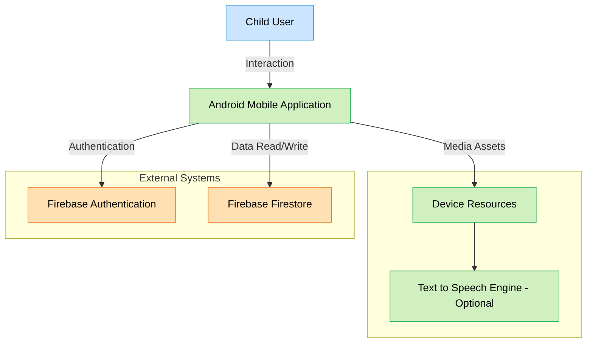
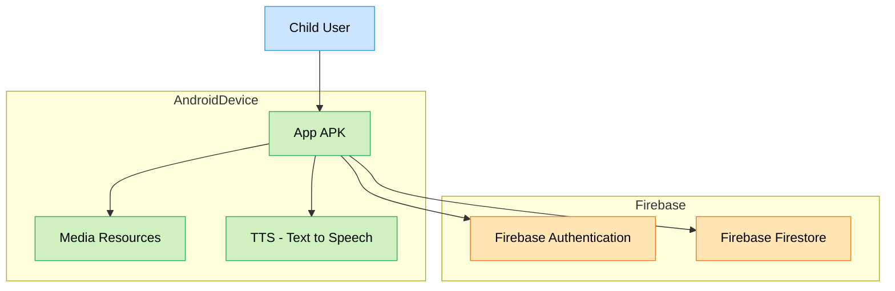
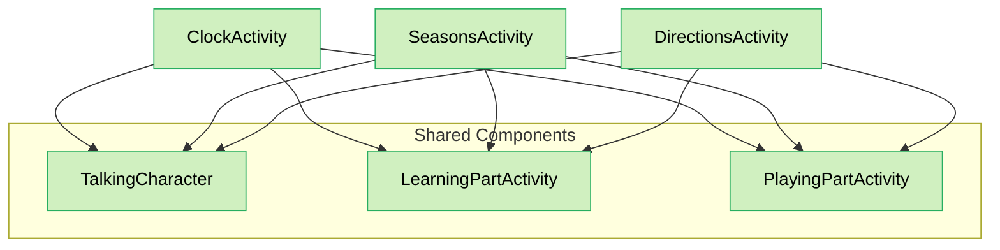

# 1. Introduction and Purpose (Architecture and Implementation Plan)

This document defines the software architecture and development plan for an Android mobile educational application to be developed during the Spring 2025 semester as part of the CMP2004 - Advanced Java Programming course. The document is structured according to the [arc42](https://arc42.org/) software architecture template.

It serves not only as a structural architecture document but also as a **development plan** that outlines which module will be developed in which file/class and how it will be organized.

The project aims to deliver educational content in a fun and interactive way for children aged 7–10. It features both learning and game modes to help children understand and reinforce the concepts.

The project will be developed in Java for the Android platform. It will manage user and score data using Firebase Authentication and Firestore and offer a user-friendly interface designed following Material Design principles.

> **Note:** Some architectural diagrams in this document are prepared using the [Mermaid](https://mermaid.js.org/) language.  
> On GitHub, these diagrams are **rendered visually**.  
> Colors and styles are used to distinguish between component types (Firebase services, device components, users, etc.):

| Color        | Meaning                                |
|--------------|----------------------------------------|
| 🟠 Orange     | Firebase services (Auth, Firestore)    |
| 🟢 Green      | On-device Android modules              |
| 🔵 Blue       | User (Child user)                      |

---

## 1.1 File Plan and Module Mapping

Below is a list of planned core functionalities and their corresponding files/classes in the project directory. This structure is architecturally inspired by the existing TinyTalks project but will be original in content and organization.

| Feature                         | File/Class Name                                   | Description                                         |
|---------------------------------|---------------------------------------------------|-----------------------------------------------------|
| Main screen and module routing  | `MainActivity.java`                               | Entry point for all game and learning modules       |
| User login/registration         | `LoginActivity.java`, `RegisterActivity.java`     | Session handling with Firebase Auth                 |
| Analog clock learning           | `ClockActivity.java`                              | Interactive clock hands and digital display         |
| Seasons                         | `SeasonsActivity.java`, `SeasonsPlayingActivity.java` | Visual content and game module for seasons         |
| Days and months                 | `DaysActivity.java`, `MonthsActivity.java`, `PlayDaysActivity.java`, `PlayMonthsActivity.java` | Sorting and game screens                           |
| Number memory (forward/back)    | `DigitForwardActivity.java`, `DigitBackwardActivity.java` | Memory enhancement games                         |
| Directions                      | `DirectionsActivity.java`, `DirectionsGameActivity.java` | Exercises showing left, right, front, back        |
| Word spelling                   | `SpellActivity.java`                              | Spelling game with visual and audio support         |
| Multiplication table            | `MultiplicationActivity.java`                     | Question-answer-based math game                     |
| Matching game                   | `SimilarPictureActivity.java`                     | Card-based visual memory game                       |
| Eye-tracking exercise           | `BallScreenActivity.java`, `GameSurface.java`, `SeamlessBackgroundView.java` | Object tracking on screen                        |
| Common structures and character | `TalkingCharacter.java`, `LearningPartActivity.java`, `PlayingPartActivity.java` | Mascot and structural managers                   |

---

## 1.2 Scope of the Document

This document is structured to achieve the following goals:
- Define the fundamental architectural structure of the application
- Plan how educational modules will be integrated into the system
- Specify the file and class structures that will guide development
- Design all components in an organized manner from the UI layer to data access

Thus, this document serves both as a **design reference** and a **project development guide** for developers.

---

# 2. Architectural Overview

This project will be developed as an Android-based mobile application providing educational content for children. Through learning and game modes, it aims to deliver interactive content on various topics (such as reading clocks, seasons, directions, memory games, multiplication tables, etc.).

The application's architecture adopts a **modular and function-based structure** to ensure simplicity, sustainability, and scalability. The project uses Android’s classic `Activity`-based structure, where each educational module is defined in a separate `Activity` class. Data handling and user interactions are managed directly through these `Activity` classes.

### 2.1 Structural Layers

- **Activity Layer:**  
  These are the screens where the user interacts directly with the application. Each game or learning module has its own dedicated `Activity`.

- **Helper/Manager Classes:**  
  These are classes that handle common functionalities, such as voice feedback, character animations, and score calculations.

- **Firebase Layer:**  
  This layer handles user authentication via Firebase Authentication and data storage via Firestore.

### 2.2 High-Level Architecture Diagram

Below is a high-level architecture diagram that shows the components of the application and the fundamental relationships between them:

### 2.3 Planning Notes

- Each `Activity` is developed as a single class containing both its visual and logical components.
- Modules include both "learning" and "game" oriented screens, and these are typically implemented as separate `Activity` files.
- Shared components (e.g., the talking character, voice responses, score calculations) are managed through centralized files such as `TalkingCharacter.java`, `LearningPartActivity.java`, and `PlayingPartActivity.java`.
- Data management is handled directly using the Firebase SDK; no additional `Repository` or `ViewModel` layer is used.
- 

# 3. Scope and Context (Context Boundary)

This mobile application is an educational tool designed to run on the Android operating system and can function both online and offline. While user interactions take place directly on the device, user identity management and data storage are synchronized with Firebase infrastructure when an internet connection is available.

The system primarily includes the following components:

### 3.1 System Scope

| Component                    | Description |
|-----------------------------|-------------|
| Android Mobile Application  | The main environment where the project operates. Users interact directly with this application. |
| Firebase Authentication     | Handles user registration and login processes. |
| Firebase Firestore          | Stores scores, game data, and user-specific progress information. |
| On-Device Resources         | All media content such as animations and images are stored locally on the device. |
| Text-to-Speech (Optional)   | Android’s native TTS service may be integrated in the future for narrated explanations. |

### 3.2 System Context Diagram

### 3.3 Out of Scope

The following elements are not directly part of the system but are indirectly related:

- **Parent Panel / Parent Account**: Currently out of scope based on project requirements; may be implemented in the future.
- **Social Media Sharing**: There is no feature to export or share user scores.
- **Multiplayer Games**: The project is limited to individual user interaction only.

### 3.4 Scope Summary Map

| Internal System Component     | External System / Resource         | Type of Relationship      |
|-------------------------------|------------------------------------|----------------------------|
| Mobile Application            | Firebase Authentication            | Login/Registration         |
| Mobile Application            | Firebase Firestore                 | Data storage               |
| Mobile Application            | Device Storage / Media Resources   | Use of visual content      |
| Mobile Application            | Android TTS (Optional)             | Voice narration (optional) |

# 4. Use Cases / User Stories

This section describes how the project's intended features are shaped from a user-centered perspective. Both user stories and detailed use cases are provided under separate subheadings.

## 4.1 User Stories

The following user stories define the expectations of the primary user group (children) and the developer from the system. Each story includes acceptance criteria.

| Who?              | Wants what?                                                       | Acceptance Criteria |
|-------------------|--------------------------------------------------------------------|---------------------|
| Developer         | To store user data using Firebase                                 | Firebase Authentication and Firestore should be successfully integrated |
| Child user        | To create an account and log into the system                      | User should be able to register with username and age; data saved in Firebase |
| Child user        | To learn the analog clock                                          | Clock hands should be draggable; digital equivalent must be shown |
| Child user        | To learn the seasons with animations                              | Each season should include audio narration and animations |
| Child user        | To learn the days in order                                         | Days should be read aloud; game must complete with correct order |
| Child user        | To learn the months in order                                       | Months should be presented in order; drag-and-drop sorting enabled |
| Child user        | To memorize numbers in order                                       | Numbers should be shown in 1-second intervals; user asked to re-enter them |
| Child user        | To memorize numbers in reverse order                              | User should be asked to enter numbers in reverse; retries allowed after mistakes |
| Child user        | To spell words correctly                                           | Words should be shown visually or audibly; spelling screen should be child-friendly |
| Child user        | To learn directional concepts                                      | Left, right, front, and back should be explained with audio and visuals |
| Child user        | To solve multiplication questions                                  | Random questions from easy to hard; scoring and positive feedback included |
| Child user        | To find matching images                                            | Cards start face down; audio/visual feedback provided on matches |
| Child user        | To visually track a moving ball on the screen                     | Ball should move in different directions; exercise should last 30–60 seconds |
| Child user        | To switch between learning and game modes                         | Each module should have a separate learning and game screen |
| Child user        | To receive positive feedback while scoring                        | Animations or voice messages should be shown upon success |
| Child with dyslexia | To see a dyslexia-friendly design                                | Large fonts, low-contrast colors, and simple icons should be used |
| Bilingual child   | To switch between Turkish and English                             | Language change should be available via settings menu |
| Child user        | To access all activities within 3 clicks                          | From the main screen, target activity should be reachable in at most 2 submenus |
| Child user        | To play a picture matching game and track their progress          | The user can flip cards to find matching images, and the app displays the number of moves and the score at the end |

## 4.2 Use Cases

Each use case describes how the system responds, interacts with users, and implements specific workflows.

This section will also guide module prioritization, test scenario generation, and UX improvements during development.

### UC-01: User Registration  
**Related Class(es):** `RegisterActivity.java`

| Field              | Content |
|--------------------|---------|
| **Use Case ID**    | UC-01 |
| **Use Case Name**  | User Registration |
| **Actors**         | Child User |
| **Description**    | A new user registers in the system |
| **Trigger**        | User opens the app for the first time |
| **Preconditions**  | 1. App must be installed 2. Internet connection must be available |
| **Normal Flow**    | 1. User opens the app 2. Clicks "Register" 3. Enters name, age, and other info 4. Clicks "Register" 5. System validates input 6. Registers user in Firebase 7. Redirects to main screen |
| **Alternative Flows** | **A1: Invalid Information** 4a. System detects invalid input 4b. Shows error 4c. User re-enters info and continues from step 4  **A2: Connection Error** 6a. Connection error occurs 6b. System shows error 6c. User clicks "Retry" and continues from step 6 |
| **Postconditions** | User is registered and logged in |
| **Frequency**      | Once per user |

---

### UC-02: User Login  
**Related Class(es):** `LoginActivity.java`

| Field              | Content |
|--------------------|---------|
| **Use Case ID**    | UC-02 |
| **Use Case Name**  | User Login |
| **Actors**         | Child User |
| **Description**    | A registered user logs into the system |
| **Trigger**        | User opens the application |
| **Preconditions**  | 1. User must be previously registered 2. Internet connection must be available |
| **Normal Flow**    | 1. User opens the app 2. Selects username/profile 3. (If needed) enters password 4. Clicks "Login" 5. System verifies credentials 6. Redirects to main screen |
| **Alternative Flows** | **A1: Incorrect Info** 5a. System detects incorrect data 5b. Shows error 5c. User re-enters info and continues from step 4  **A2: Forgot Password** 3a. User clicks "Forgot Password" 3b. System starts password reset process |
| **Postconditions** | User successfully logs in and sees main screen |
| **Frequency**      | At each app start (if not already logged in) |

---

### UC-03: Analog Clock Learning  
**Related Class(es):** `ClockActivity.java`

| Field              | Content |
|--------------------|---------|
| **Use Case ID**    | UC-03 |
| **Use Case Name**  | Analog Clock Learning |
| **Actors**         | Child User |
| **Description**    | User learns to read an analog clock |
| **Trigger**        | User selects the "Clock Learning" activity |
| **Preconditions**  | 1. User must be logged in |
| **Normal Flow**    | 1. User selects "Clock Learning" 2. System displays animated clock module 3. Explains reading clock concepts step by step 4. User interacts with the hands 5. Shows digital and verbal output 6. User switches to "Game Mode" 7. System shows random clock and asks for correct time 8. Provides feedback |
| **Alternative Flows** | **A1: Repeat Learning** 7a. User clicks "Learn Again" 7b. System returns to step 3 |
| **Postconditions** | User learns the analog clock and practices it |
| **Frequency**      | As needed, likely multiple times |

---

### UC-04: Learning Seasons  
**Related Class(es):** `SeasonsActivity.java`, `SeasonsPlayingActivity.java`

| Field              | Content |
|--------------------|---------|
| **Use Case ID**    | UC-04 |
| **Use Case Name**  | Learning Seasons |
| **Actors**         | Child User |
| **Description**    | User learns seasons through multimedia animations |
| **Trigger**        | User selects the "Seasons" activity |
| **Preconditions**  | 1. User must be logged in |
| **Normal Flow**    | 1. User selects "Seasons" 2. System shows animations for four seasons 3. Narration and visuals are provided 4. User switches between seasons 5. Switches to "Game Mode" 6. System asks questions 7. Provides feedback and saves score |
| **Alternative Flows** | **A1: View Specific Season** 3a. User selects a season 3b. System shows detailed animation for that season |
| **Postconditions** | User completes the activity and learns the seasons |
| **Frequency**      | As needed, several times |

---

### UC-05: Days and Months Learning  
**Related Class(es):** `DaysActivity.java`, `MonthsActivity.java`, `PlayDaysActivity.java`, `PlayMonthsActivity.java`

| Field            | Content |
|------------------|---------|
| **Use Case ID**  | UC-05 |
| **Use Case Name**| Days and Months Learning |
| **Actors**       | Child User |
| **Description**  | Learning the days of the week and months of the year |
| **Trigger**      | User selects the "Calendar" activity |
| **Preconditions**| 1. User must be logged in |
| **Normal Flow**  | 1. User selects "Calendar" 2. System shows options: "Days" / "Months" 3. User selects one 4. System displays and reads items in order 5. User switches to "Game Mode" 6. System shuffles items and asks user to sort 7. User uses drag-and-drop to sort 8. System provides feedback |
| **Alternative Flows** | **A1: Difficulty in Sorting** 7a. User clicks "Hint" 7b. System shows next correct item |
| **Postconditions**| User completes correct sorting and learning |
| **Frequency**    | As often as user desires |

---

### UC-06: Forward Number Memory  
**Related Class(es):** `DigitForwardActivity.java`

| Field            | Content |
|------------------|---------|
| **Use Case ID**  | UC-06 |
| **Use Case Name**| Forward Number Memory |
| **Actors**       | Child User |
| **Description**  | User memorizes numbers in the order shown |
| **Trigger**      | User selects "Forward Memory" activity |
| **Preconditions**| 1. User must be logged in |
| **Normal Flow**  | 1. User selects "Memory Games" > "Forward Memory" 2. System shows starting level (3 digits) 3. Numbers appear at 1-second intervals 4. System asks user to input 5. User inputs numbers 6. System checks correctness 7. If correct, difficulty increases |
| **Alternative Flows** | **A1: Incorrect Answer** 7a. Retry allowed 7b. After 3 errors, level decreases |
| **Postconditions**| User completes game and earns points |
| **Frequency**    | Frequently |

---

### UC-07: Backward Number Memory  
**Related Class(es):** `DigitBackwardActivity.java`

| Field            | Content |
|------------------|---------|
| **Use Case ID**  | UC-07 |
| **Use Case Name**| Backward Number Memory |
| **Actors**       | Child User |
| **Description**  | User memorizes and enters numbers in reverse |
| **Trigger**      | User selects "Backward Memory" activity |
| **Preconditions**| 1. User must be logged in |
| **Normal Flow**  | 1. User selects "Memory Games" > "Backward Memory" 2. System shows starting level (2 digits) 3. Numbers appear 4. User enters numbers in reverse 5. System checks correctness 6. If correct, level increases |
| **Alternative Flows** | **A1: Incorrect Answer** 6a. Retry allowed 6b. After 3 errors, level decreases |
| **Postconditions**| User succeeds and scores |
| **Frequency**    | Frequently |

---

### UC-08: Word Spelling  
**Related Class(es):** `SpellActivity.java`

| Field            | Content |
|------------------|---------|
| **Use Case ID**  | UC-08 |
| **Use Case Name**| Word Spelling |
| **Actors**       | Child User |
| **Description**  | User learns correct spelling of words |
| **Trigger**      | User selects "Word Games" activity |
| **Preconditions**| 1. User must be logged in |
| **Normal Flow**  | 1. User selects "Word Games" 2. System shows a visual and/or audio cue 3. User is asked to spell 4. User types word 5. System checks spelling and gives feedback 6. If correct, move to next word with points |
| **Alternative Flows** | **A1: Misspelled Word** 5a. Error detected 5b. 3 retries allowed 5c. Hint shown on 2nd error 5d. Correct spelling shown on 3rd error |
| **Postconditions**| User completes spelling activity |
| **Frequency**    | As often as user desires |

---

### UC-09: Direction Concepts Learning  
**Related Class(es):** `DirectionsActivity.java`, `DirectionsGameActivity.java`

| Field            | Content |
|------------------|---------|
| **Use Case ID**  | UC-09 |
| **Use Case Name**| Direction Concepts Learning |
| **Actors**       | Child User |
| **Description**  | User learns basic direction concepts |
| **Trigger**      | User selects "Directions" activity |
| **Preconditions**| 1. User must be logged in |
| **Normal Flow**  | 1. User selects "Directions" 2. System explains with animated characters 3. Visual and audio guidance per direction 4. User switches to "Game Mode" 5. User places objects in correct direction 6. Drag-and-drop interaction 7. System checks and gives feedback |
| **Alternative Flows** | **A1: Incorrect Placement** 7a. System shows error 7b. Retry allowed |
| **Postconditions**| User understands directional concepts |
| **Frequency**    | As often as user desires |

---

### UC-10: Multiplication Table Learning  
**Related Class(es):** `MultiplicationActivity.java`

| Field            | Content |
|------------------|---------|
| **Use Case ID**  | UC-10 |
| **Use Case Name**| Multiplication Table Learning |
| **Actors**       | Child User |
| **Description**  | User learns multiplication tables |
| **Trigger**      | User selects "Math > Multiplication Table" activity |
| **Preconditions**| 1. User must be logged in |
| **Normal Flow**  | 1. User enters "Math" 2. Selects "Multiplication Table" 3. System presents visual explanation 4. User switches to "Game Mode" 5. Random multiplication questions shown 6. User enters answer 7. System checks and gives feedback 8. Points awarded for correct answers |
| **Alternative Flows** | **A1: Incorrect Answer** 7a. System shows error 7b. Correct answer shown after 3 wrong attempts |
| **Postconditions**| User completes the activity |
| **Frequency**    | As often as user desires |

---

### UC-11: Matching Game  
**Related Class(es):** `SimilarPictureActivity.java`

| Field            | Content |
|------------------|---------|
| **Use Case ID**  | UC-11 |
| **Use Case Name**| Matching Game |
| **Actors**       | Child User |
| **Description**  | User matches similar images |
| **Trigger**      | User selects "Matching Game" activity |
| **Preconditions**| 1. User must be logged in |
| **Normal Flow**  | 1. User selects "Matching Game" 2. System asks difficulty level 3. User selects (easy/medium/hard) 4. Grid of closed cards shown 5. User opens two cards 6. If match, they stay open; if not, close again 7. Continue until all matched 8. Points based on time and attempts |
| **Alternative Flows** | **A1: Restart Game** 8a. User clicks "Restart" 8b. System resets game |
| **Postconditions**| All cards matched, score given |
| **Frequency**    | Frequently |

---

### UC-12: Eye Tracking Exercise  
**Related Class(es):** `BallScreenActivity.java`, `GameSurface.java`, `SeamlessBackgroundView.java`

| Field            | Content |
|------------------|---------|
| **Use Case ID**  | UC-12 |
| **Use Case Name**| Eye Tracking Exercise |
| **Actors**       | Child User |
| **Description**  | User follows a moving ball with their eyes |
| **Trigger**      | User selects "Eye Tracking" activity |
| **Preconditions**| 1. User must be logged in |
| **Normal Flow**  | 1. User selects "Eye Tracking" 2. System explains purpose 3. User clicks "Start" 4. Ball moves in different directions 5. User tracks it visually 6. Feedback and score at the end |
| **Alternative Flows** | **A1: Change Difficulty** 3a. User selects difficulty 3b. System adjusts speed/pattern |
| **Postconditions**| Exercise completed, score shown |
| **Frequency**    | Frequently |

---

### UC-13: Picture Matching Game  
**Related Class(es):** `SimilarPictureActivity.java`

| Field              | Content |
|--------------------|---------|
| **Use Case ID**    | UC-13 |
| **Use Case Name**  | Picture Matching Game |
| **Actors**         | Child User |
| **Description**    | The user matches pairs of pictures on cards and receives feedback based on the number of moves made |
| **Trigger**        | The user selects the "Picture Matching Game" activity |
| **Preconditions**  | 1. The user is logged in 2. Game assets are available locally |
| **Main Flow**      | 1. The user selects the Picture Matching Game from the main menu 2. The system asks the user to select a difficulty level 3. The system displays a grid of face-down cards 4. The user flips two cards 5. If the cards match, they remain face-up; otherwise, they are turned back over 6. Steps 4–5 repeat until all pairs are matched 7. The system displays the number of moves made and awards a score |
| **Alternative Flows** | **A1: Game Reset** 7a. The user taps "Restart" 7b. The system resets the card layout and move count |
| **Postconditions** | The user completes the game and is shown performance metrics |
| **Frequency**      | As often as the user wants |

---

# 5. Solution Strategy

This section summarizes the core design decisions, technologies to be used, and overall solution strategies for the system. The chosen approaches aim to ensure a user experience tailored to the target audience — children aged 7 to 10.

## 5.1 Platform and Language

- The target platform is the **Android** mobile operating system.
- The application will be developed using the **Java** programming language.
- Android SDK tools will be used in combination with the **Android Studio** IDE.

## 5.2 Architectural Approach

- The application follows a traditional **Activity-based architecture**.
- Each learning module is defined as an independent `Activity` class and manages its own functionality directly.
- UI components will be designed to be child-friendly, adhering to **Material Design** principles.

## 5.3 Data Management and Synchronization

- User registration and login processes will be handled via **Firebase Authentication**.
- Data such as scores, game progress, and user profiles will be stored on **Firebase Firestore**.
- Data access and synchronization will be achieved directly through the Firebase SDK.

## 5.4 Media and Interaction

- **Animations, icons, audio files, and characters** will be stored locally on the device.
- All user interfaces will be designed with simplicity and child-friendliness in mind.
- For voice narration, Android’s built-in **Text-to-Speech (TTS)** engine may be optionally integrated.

## 5.5 Extensibility and Maintainability

- All learning modules will follow a common development template based on the `LearningActivity` and `PlayingActivity` concept.
- Shared components (mascot character, scoring, feedback sounds) will be implemented as **abstract base classes** or placed in reusable `utils` or `managers` packages.
- The design will allow for easy future extensions such as adding new modules, switching languages, or visualizing data.

## 5.6 Testing Strategy

- **Instrumentation tests** will be used at the application level to verify activity behaviors.
- Firebase synchronization and user scenarios will be primarily validated through manual testing.
- Basic **unit test** classes will be implemented by the developer to verify correctness.

---

# 6. Building Block View

This section describes the components of the application, their responsibilities, and their structural relationships in a layered format. Each component consists of sub-units that serve different functions.

## 6.1 Top-Level Components

The application consists of the following high-level components:

- **Activity Layer:**  
  Contains both user interfaces and business logic. Each learning or game module has its own dedicated `Activity` class.

- **Helper Classes:**  
  Independent classes used for shared functionality like character animation, voice narration, and game control mechanisms (e.g., `TalkingCharacter`, `LearningPartActivity`).

- **Firebase Layer:**  
  `Firebase Authentication` handles user session operations, and `Firestore` is used for storing scores and user data.

- **Assets / Resources:**  
  Media content such as images, audio files, and animations are located in this layer.

## 6.2 Top-Level Structure Diagram

```mermaid
flowchart TB
    classDef android fill:#d0f0c0,stroke:#27ae60,color:#000;
    classDef firebase fill:#ffe0b2,stroke:#e67e22,color:#000;

    UI[Activity Classes]:::android

    subgraph Clock & Calendar Modules
        Clock[ClockActivity]:::android
        Days[DaysActivity]:::android
        Months[MonthsActivity]:::android
    end

    subgraph General Teaching Modules
        Seasons[SeasonsActivity]:::android
        Directions[DirectionsActivity]:::android
        Spell[SpellActivity]:::android
    end

    subgraph Mathematichs Modules
        Forward[DigitForwardActivity]:::android
        Backward[DigitBackwardActivity]:::android
        Multiply[MultiplicationActivity]:::android
    end

    subgraph Game Modules
        Match[SimilarPictureActivity]:::android
        Eye[BallScreenActivity]:::android
    end

    subgraph Helpers and Services
        HELPERS[Helper Classes]:::android
        FIREBASE[Firebase Services]:::firebase
    end

    UI --> Clock
    UI --> Days
    UI --> Months

    UI --> Seasons
    UI --> Directions
    UI --> Spell

    UI --> Forward
    UI --> Backward
    UI --> Multiply

    UI --> Match
    UI --> Eye

    UI --> HELPERS
    UI --> FIREBASE
```

(Same as the diagram in section 2.2)

## 6.3 Component Descriptions

| Component                      | Description |
|-------------------------------|-------------|
| `MainActivity`                | Main screen. Directs users to learning and game modules. |
| `ClockActivity`              | Analog clock learning and interaction screen. |
| `SeasonsActivity`            | Animated presentation of the seasons. |
| `DaysActivity`, `MonthsActivity` | Educational modules for days of the week and months. |
| `DigitForwardActivity`       | Game screen for memorizing numbers in order. |
| `DigitBackwardActivity`      | Game screen for memorizing numbers in reverse order. |
| `SpellActivity`              | Game screen for learning correct spelling of words. |
| `DirectionsActivity`         | Teaches direction concepts like left, right, front, and back. |
| `MultiplicationActivity`     | Game screen focused on multiplication tables and math questions. |
| `SimilarPictureActivity`     | Visual memory game and card matching screen. |
| `BallScreenActivity`         | Eye tracking exercise where the user follows a moving ball. |
| `TalkingCharacter`, `LearningPartActivity`, `PlayingPartActivity` | Shared components managing characters, animations, and learning/game structures. |
| `FirebaseAuth`, `Firestore`  | Provide user authentication and data storage services. |
| `Assets`                     | Contains the app’s media resources such as images, sounds, and animations. |

# 7. Deployment View

This section describes the operating environment, deployment model, and required platform dependencies of the application. The app is designed to run on Android devices and utilizes Firebase as a cloud backend service.

## 7.1 Deployment Environment

| Component               | Deployment Target                        | Description |
|------------------------|------------------------------------------|-------------|
| Android Application     | Devices running Android 8.0 (API 26) or higher | The physical device where the app runs |
| Firebase Authentication | Cloud (Firebase)                         | Manages user authentication |
| Firebase Firestore      | Cloud (Firebase)                         | Stores user data, scores, and progress |
| Media Assets            | Local device storage                     | Images, audio files, and animations are stored locally |
| Text-to-Speech (TTS)    | On-device service (optional)             | May be used for voice narration |

## 7.3 Dependencies and Requirements

| Requirement                | Description |
|---------------------------|-------------|
| Android 8.0+ (API 26+)     | Minimum supported version of the app |
| Internet Connection        | Required for Firebase operations (initial registration, data sync, etc.) |
| Firebase Account           | Needed to configure Auth and Firestore services |
| Android Studio & Gradle    | Required for development and build processes |
| Multi-language Support     | The app must include both Turkish and English language packs |
| Local Audio & Visual Assets| Media files are stored in the device's internal storage |

## 7.4 Notes

- All data will be stored in structured Firestore collections (e.g., `users`, `scores`).
- No integrations with systems outside Firebase are planned.
- The application can work offline; however, an internet connection is needed for login and data synchronization.
- The Text-to-Speech feature will be available only on supported devices.

---

# 8. Cross-cutting Concepts

This section discusses common concerns that affect the entire system, such as recurring patterns across modules, general design principles, UI consistency, language support, security, and accessibility.

## 8.1 Multi-language Support

- The application will support **two languages**: **Turkish and English**.
- All text content will be defined in `strings.xml` resource files.
- Users can easily change their language preference from the settings menu.
- Text-to-Speech (TTS) support may be provided in both languages for voice narration.

## 8.2 Consistent UI Design

- All `Activity` screens will follow **Material Design** principles with a simple and child-friendly interface.
- The main character (mascot) and similar UI elements will be consistently reused across all modules.
- Colors, button placements, and feedback mechanisms will be standardized throughout the app.

## 8.3 Audio and Visual Feedback

- In cases of success, error, or interaction, both **audio** (positive feedback sound) and **visual** (animations, icons, color transitions) feedback will be provided.
- Especially in learning screens, children will be encouraged to recognize correct answers through visual cues.

## 8.4 User Experience (UX)

- The user will be able to reach any module from the main screen in **no more than 3 taps**.
- The interface is designed to be clean and distraction-free, considering special learning needs such as dyslexia.
- Texts will be large, readable, and displayed in a child-appropriate font.

### 8.5 Shared Code Reuse

- Classes like `TalkingCharacter`, `LearningPartActivity`, and `PlayingPartActivity` are used to **avoid code duplication** between modules.
- Functions such as feedback animations, TTS calls, and score calculations will be managed from a single point (e.g., `utils`, `manager` classes).
- The infrastructure is designed to allow easy reuse by any new learning or game module.

Below is a structural diagram showing how these shared components are reused across various modules:

## 8.6 Offline Access

- The application is designed to work offline.
- Once the user is logged in, games, images, sounds, and animations can be accessed from the device's internal storage.
- Firebase is used only for synchronization and persistent data storage.

# 9. Resources and References

The following sources were referenced during the preparation of this architecture document:

- [arc42 - Software Architecture Template](https://arc42.org/)
- [Google Firebase Documentation](https://firebase.google.com/docs)
- [Android Developers - Official Docs](https://developer.android.com/docs)
- [Material Design Guidelines](https://m3.material.io/)
- [Mermaid Live Editor (Diagram Drawing)](https://mermaid.live/)
- [Android Studio (Official IDE)](https://developer.android.com/studio)
- [Text-to-Speech (TTS) on Android](https://developer.android.com/reference/android/speech/tts/TextToSpeech)
- [Android App Bundles & APK Structure](https://developer.android.com/guide/app-bundle)
